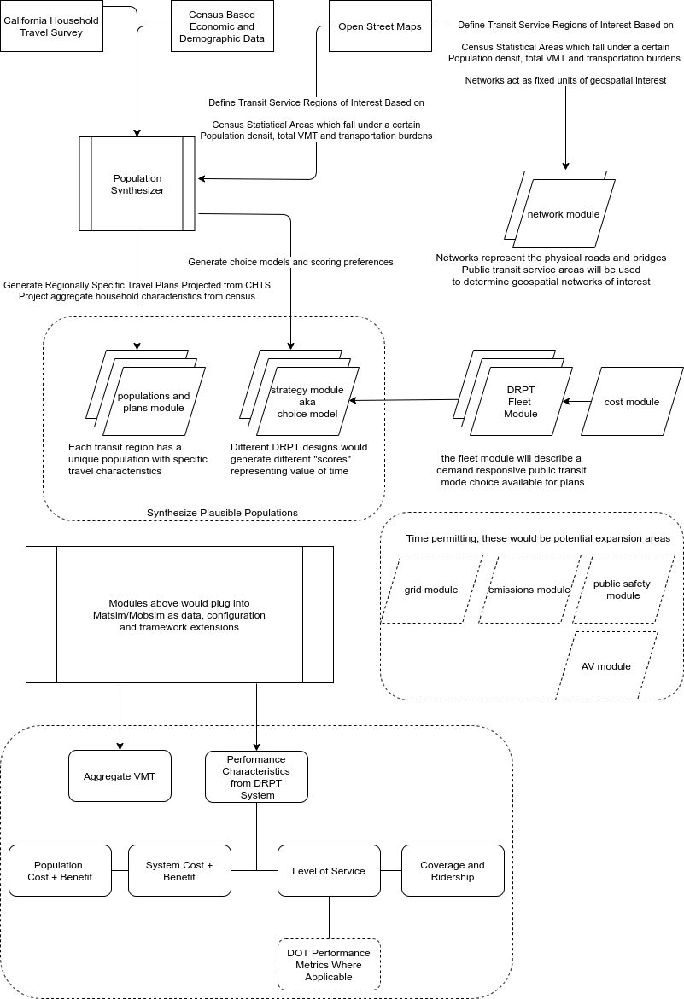

Proposal
========

The focus of this thesis is to model a fleet of non-autonomous vehicles dispatched within a rural geography, responding to a pool of ride hailing requests.  The purpose of this thesis is to determine circumstances in which a public demand responsive fleet can reliably serve rural mobility needs.  While the motivating question is in respect to rural communities, the proposed analysis aims to focus on Humboldt County as a representative community for rural transportation challenges.

Additionally, this thesis aims to understand non-mobility issues of a public DRT services such as:

- What fiscal impacts or pressures would a public DRT service create for local transportation budgets?
- What technological, operational and political barriers exist in deploying a public DRT program?

Methods and Approaches
----------------------

The proposed approach is to leverage an :abbr:`ABM (Agent Based Model)` :cite:`Evans2013` to simulate a demand-responsive public transit fleet as a source of transportation supply.  Agent based models have historically been used extensively in transportation modeling and planning activities :cite:`Kagho2020`.  

The goal of this modeling is to evaluate performance metrics such as wait time, passengers miles served, and system costs of a demand responsive public transit fleet trying to serve different levels of community mobility demand.  This modeling work can be broken into two modeling activities:

- Creation of mobility demand scenarios which capture varying levels of demand across different population characteristics and varying activity schedules (i.e. population synthesis)
- Trip modeling based on a dispatchable fleet of vehicles providing ride pooling with scenarios varying across fleet size and individual vehicle specifications.

Each mobility demand scenarios will be fed into the ABM as inputs, and evaluated against a fleet attempting to fulfill ride requests.  Existing tools such as activitysim [#]_ will be used to generate activity schedules and synthesize populations. In order to model transportation supply characteristics, this thesis intends to leverage existing ABM tools such as the BEAM model :cite:`BEAM`.  For example, a single demand scenario might describe a population where by 20% of a community intends to use the DRT service for a single leg in their daily schedules.  A single fleet scenario might describe a fleet of 10 micro-shuttles capable of pooling up to 10 rides each. 

By evaluating different fleets across demand scenarios, this thesis will attempt to identify fleet characteristics needed to meet mobility needs of many different potential populations with varying levels of demand for a public mobility service.

  Scenarios will be generated from combining characteristics of different modules as shown above.  The full result size will be the cross product of Populations x Fleet Designs.  Aggregate results will be used to determine where a theoretical demand responsive public transit system could be used to effectively provide local mobility services.

Population Synthesis
::::::::::::::::::::

Population data is a critical input for an agent based model.  Travel decisions are modeled for every individual traveling within a Transportation Analysis Zone (TAZ).  Synthetic agents (persons) are typically modeled as follows for a single simulated day of trips:

- A sequential set of plans each describing an origin and destination trip with a start and end time and travel mode.
- Attributes of interest such as employment status, age, gender, income group, etc.  Person attributes may be inputs into a scoring function when evaluating mode choices for every individual agent.  

Three components are needed to create a synthetic population:

1.  Population characteristics
2.  Points of interest located within the network in the travel analysis zone
3.  Travel diaries describing trip behavior for individuals

Population characteristics such as household size, employment status, age, race and income will be post-stratified and distributed via proportions to synthetic populations at a census block level.  Points of interest (i.e. travel locations) will be generated from publicly available commercial mapping data and used as destinations and origins for travel tours.  Finally, travel diaries will be assigned based on travel survey data from sources such as the California Household Travel Survey :cite:`NREL2017`.  These data will be compiled into a dimensional datawarehouse that can be used to generate inputs for the ABM software representing different levels of demand for the DRPT service.

Trip Mode modeling & Scenario analysis
::::::::::::::::::::::::::::::::::::::

The central focus of this thesis is to evaluate a public transit fleet operating like a modern TNC.  TNC modeling in ABMs has been implemented in open source ABMs such as BEAM :cite:`BEAM`.  The DRPT fleet in this thesis will strongly resemble a TNC with constraints based on real-world economic and implementation constraints.  Constraints that existing TNCs don't face such as fixed fleet size, higher operator costs, are examples of issues which might be modeled. 

- Different types of fleets could be deployed with varying costs - a larger fleet of small microshuttles would operate differently from a small fleet of larger buses.
- Different routing and dispatch strategies should be evaluated.  Real world deployments such as RideWithVia's SMART ride program operate on a semi-fixed route which change based on time of day and demand, but TNCs like Uber and Lyft create completely dynamic stops and routes.

Goals and Desired Outcomes
==========================

This thesis aims to produce the following artifacts

- A model for evaluating DRT cost effectiveness for different population characteristics.
- A catalog of different DRT service architectures and designs (differing on vehicle size, fleet size, dispatch methods, payment schedules, and potential coverage goals - i.e. how large can a service area get?)
- An extensible BEAM compatible framework for public consumption to evaluate potential of new demand responsive public transit systems.
  - An extensible tool for generating populations that could plug in publicly accessible data or more granular, localized, representative survey data.

Potential Expanded Scope of Work
--------------------------------

The approach above lends itself to future work, which may or may not be addressed over the course of the thesis.  By expanding understanding into new mobility service deployments, these issues may be addressed in the future.

- What grid services or burdens would a public DRT fleet present (both autonomous and non-autonomous fleets)?
  - What charging strategies should be deployed from medium and heavy duty commercial/public fleets?
  - Is it economical or does it make sense to use fleets as grid producer-consumers? or should they remain strictly consumers?
- What are the potential emissions benefits or harms in transportation deserts as a result of DRT services compared to traditional public transit systems and personal vehicle travel?
- What are social and cultural barriers to adopting and accepting new mobility systems over personal vehicle ownership? 
- What public safety implications are there from expanded deployments of shared fleets over a highly distributed personal fleet?

.. rubric:: Footnotes

.. [#] https://activitysim.github.io/
