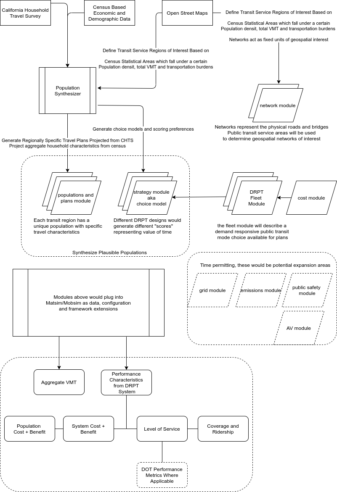

----------------------------------------

Population Synthesis
::::::::::::::::::::

Population data is a critical input for an agent based model.  Travel decisions are modeled for every individual traveling within a Transportation Analysis Zone (TAZ).  Synthetic agents (persons) are typically modeled as follows for a single simulated day of trips:

- A sequential set of plans each describing an origin and destination trip with a start and end time and travel mode.
- Attributes of interest such as employment status, age, gender, income group, etc.  Person attributes may be inputs into a scoring function when evaluating mode choices for every individual agent.  

Three components are needed to create a synthetic population:

1.  Population characteristics
2.  Points of interest located within the network in the travel analysis zone
3.  Travel diaries describing trip behavior for individuals

Population characteristics such as household size, employment status, age, race and income will be post-stratified and distributed via proportions to synthetic populations at a census block level.  Points of interest (i.e. travel locations) will be generated from publicly available commercial mapping data and used as destinations and origins for travel tours.  Finally, travel diaries will be assigned based on travel survey data from sources such as the California Household Travel Survey :cite:`NREL2017`.  These data will be compiled into a dimensional datawarehouse that can be used to generate inputs for the ABM software representing different levels of demand for the DRPT service.

Trip Mode modeling & Scenario analysis
::::::::::::::::::::::::::::::::::::::

The central focus of this thesis is to evaluate a public transit fleet operating like a modern TNC.  TNC modeling in ABMs has been implemented in open source ABMs such as BEAM :cite:`BEAM`.  The microtransit fleet in this thesis will strongly resemble a TNC with constraints based on real-world economic and implementation constraints.  Constraints that existing TNCs don't face such as fixed fleet size, higher operator costs, are examples of issues which might be modeled. 

- Different types of fleets could be deployed with varying costs - a larger fleet of small microshuttles would operate differently from a small fleet of larger buses.
- Different routing and dispatch strategies should be evaluated.  Real world deployments such as RideWithVia's SMART ride program operate on a semi-fixed route which change based on time of day and demand, but TNCs like Uber and Lyft create completely dynamic stops and routes.

  Scenarios will be generated from combining characteristics of different modules as shown above.  The full result size will be the cross product of Populations x Fleet Designs.  Aggregate results will be used to determine where a theoretical demand responsive public transit system could be used to effectively provide local mobility services.
