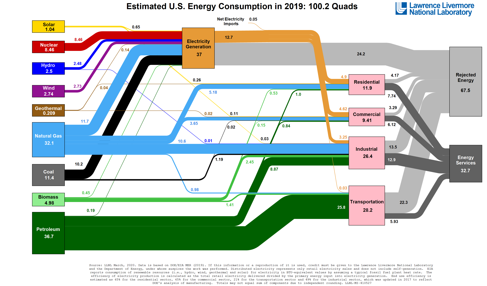

# Problem Statement

Petroleum end uses consumed over 1/3rd of U.S. Energy usage in 2019.  Whereas significant technological, economic and political progress has been made on decarbonising the electricity sector with wide-spread supply side 

## Motivation

>  "The environmental movement is very middle class ... and its organizations do not challenge middle class values.  While few environmentalists were willing to dispense with, for example, air conditioning, they are receptive to producing it with the least damage to the ecology."  

- Thomas Princen, Confronting Consumption

